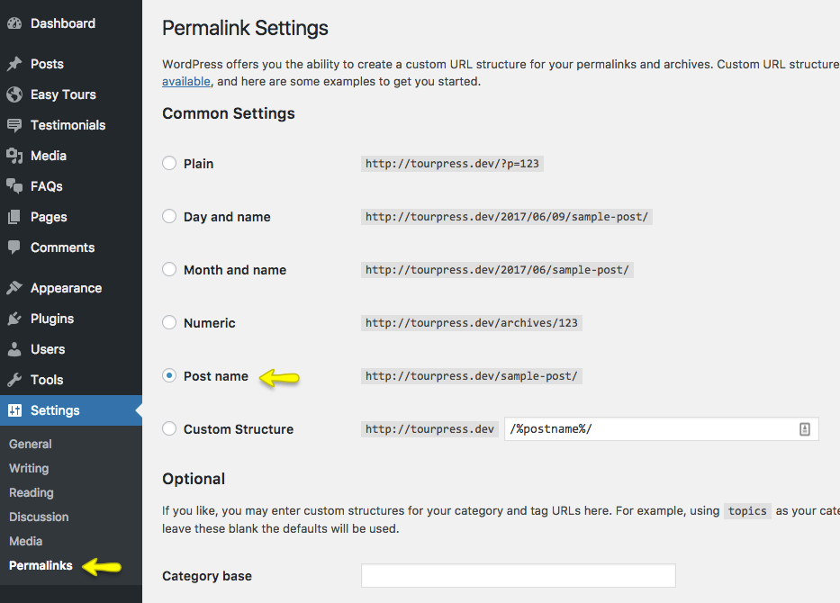
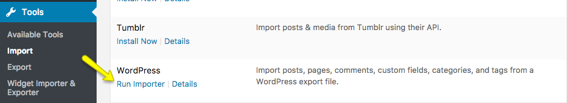
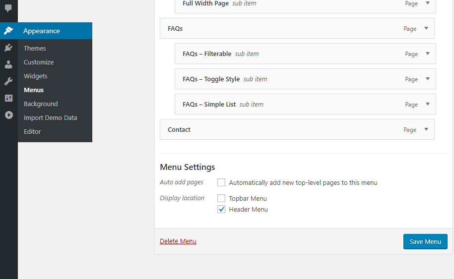
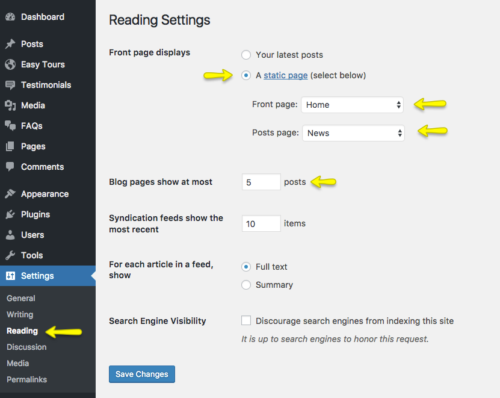

## 🚀 1. Import Demo Data (Automatic – Recommended)

The easiest and most efficient way to set up your site like the demo is by using the One Click Demo Import feature. Follow the steps below carefully:

### 🔧 Step 1: Set Permalinks to “Post Name”

Before importing any demo content, go to: `Dashboard → Settings → Permalinks`  
Select the option: **Post name**, and click **Save Changes**.

!!! warning ""
    This step is crucial. The demo import process is built to work with “pretty permalinks”. If you skip this, you may encounter issues with pages and menus after import.

---

### 📥 Step 2: Run the Demo Import

1. Navigate to: `Dashboard → Appearance → Import Demo Data`

2. Click the **Import Demo Data** button.

   

3. The process may take a couple of minutes. Please be patient and do not navigate away during import.

4. Once completed, your website will resemble the theme demo with pages, posts, tours, widgets, and styling applied.

5. (Optional) You can now deactivate and delete the **One Click Demo Import** plugin from the `Plugins` page.

---

### 🧭 What to Do Next?

Visit your site to verify the imported content.  
If anything looks off or doesn’t match the demo, feel free to contact our [Support Team](https://support.inspirythemes.com/).

---

## 🛠️ 2. Manual Import: XML + Customizer + Widgets

If the automatic method doesn't work or you prefer full control, use the manual import method. Follow all steps below for best results:

### 🔧 Step 1: Set Permalinks

Go to: `Dashboard → Settings → Permalinks → Post Name`, then **Save Changes**  
(Same as automatic method)

---

### 📦 Step 2: Install the WordPress Importer

1. Navigate to:  `Dashboard → Tools → Import`

2. Under the **WordPress** section, click **Install Now**  
   

3. After installation, click **Run Importer**  
   

---

### 📄 Step 3: Import XML Content

1. Locate the XML file inside the “Import XML” folder of your extracted theme package.
2. Upload the XML file using the WordPress Importer.

   

3. Assign the demo content to an existing user.
4. Check the option: **Download and import file attachments**
5. Click **Submit** and wait for the process to complete.  
   (It may take a few minutes. Do not refresh the page.)

   

You’ll now have demo pages, posts, tours, and other content added to your site.

   

---

### 🧭 Step 4: Setup the Navigation Menu

1. Go to: `Dashboard → Appearance → Menus`
2. Select the imported demo menu.
3. Assign it to the “Header Menu” location.
4. Click **Save Menu**.

   

---

### 🏠 Step 5: Configure the Homepage

Go to: `Dashboard → Settings → Reading`

1. Set “Your homepage displays” to: **A static page**
2. Choose:
   - Homepage: `Home`
   - Posts page: `News`
3. Click **Save Changes**

   

---

### 🎨 Step 6: Import Customizer Settings

1. Install the plugin: [Customizer Export/Import](https://wordpress.org/plugins/customizer-export-import/)
2. After activation, go to:  `Dashboard → Appearance → Customize → Export/Import`
3. Select the file named: `customizer.dat` from the theme package.
4. Click **Import**.

   

Your theme styles and layout will update instantly after import.

---

### 🧩 Step 7: Import Widgets

1. Install the plugin: [Widget Importer & Exporter](https://wordpress.org/plugins/widget-importer-exporter/)
2. Navigate to:  `Dashboard → Tools → Widget Importer & Exporter`
3. Choose the file: `widgets.wie`
4. Click **Import Widgets**

   

Once complete, your sidebar and footer widgets will reflect the demo layout.

---

## 🎉 All Set!

Visit your site and explore the frontend. You should now have a fully functional travel/tour booking website that mirrors the TourPress demo.

If anything goes wrong or if you're unsure about any step, don’t hesitate to reach out to our [support team](https://support.inspirythemes.com/) — we're here to help!
