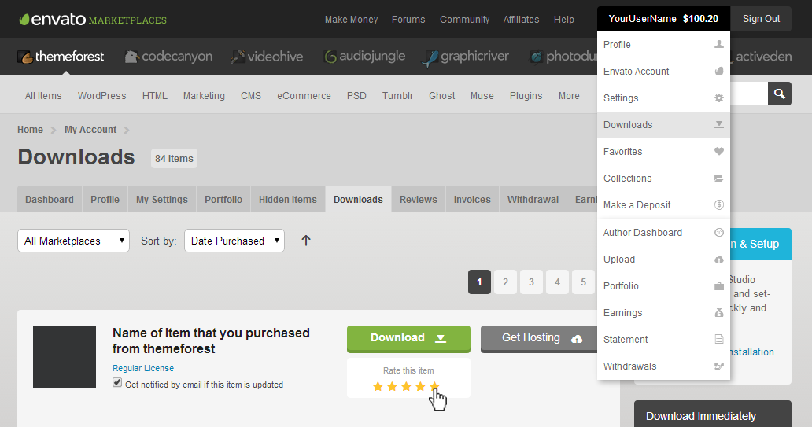

!!! success "Documentation Updated: **4th July 2025** | Latest TourPress Theme Version: **v1.2.4**"

Thank you for choosing **TourPress – WordPress Theme for Travel & Tour Booking**. This guide will walk you through everything from installation and setup to advanced customization options.

If you run into questions beyond the scope of this guide, our support team is here to help — simply head over to our [Support Center](https://support.inspirythemes.com/). Need help signing up? Learn how to retrieve your ThemeForest purchase code [here](https://support.inspirythemes.com/knowledgebase/how-to-get-themeforest-item-purchase-code/).

---

## 🚩 Getting Started

Before diving in, make sure your hosting meets the [WordPress requirements](https://wordpress.org/about/requirements/). TourPress works seamlessly on shared, managed, or dedicated hosting setups that support WordPress.

A ready-to-use demo, intuitive page builder support, and detailed settings make it easy to launch a beautiful and functional travel booking site quickly.

---

## 🛡️ Use a Child Theme (Highly Recommended)

If you plan to make any modifications to theme files, we strongly recommend using a child theme. This ensures that your changes are preserved during theme updates. A ready-to-use child theme is included in the TourPress package you downloaded from ThemeForest.

Learn more about child themes in the official WordPress documentation: [What is a Child Theme?](https://codex.wordpress.org/Child_Themes)

---

## 💬 Support Policy

We’re committed to helping you get the most out of TourPress. Here’s what our standard support includes:

✅ What’s Covered

- Technical questions about built-in features  
- Bug reports and issue resolution  
- Assistance with included third-party assets

🚫 What’s Not Covered

- Custom development or theme customization  
- Installation or hosting setup

Need assistance? Visit our [Support Portal](https://support.inspirythemes.com/ask-question/) to get started.

---

## ⬆️ How to Update TourPress

To keep your site secure and feature-rich, it’s important to stay up to date with the latest version of TourPress. You can update the theme in two ways:

- [Automatic Update Guide](https://support.inspirythemes.com/knowledgebase/update-theme-automatically/)  
- [Manual Update Instructions](https://support.inspirythemes.com/knowledgebase/update-theme-manually/)

---

## ⭐️ Like TourPress? Leave a Review!

If you’re happy with your experience using TourPress, we’d greatly appreciate a 5-star rating on ThemeForest. Your feedback motivates us to keep improving and delivering better features.

---

Now that you're set, let's begin with the Installation process →
