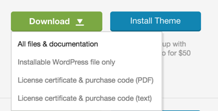
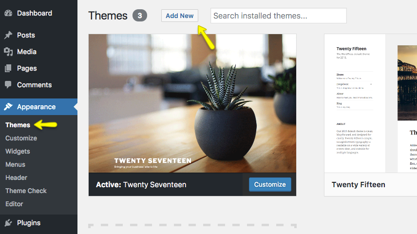
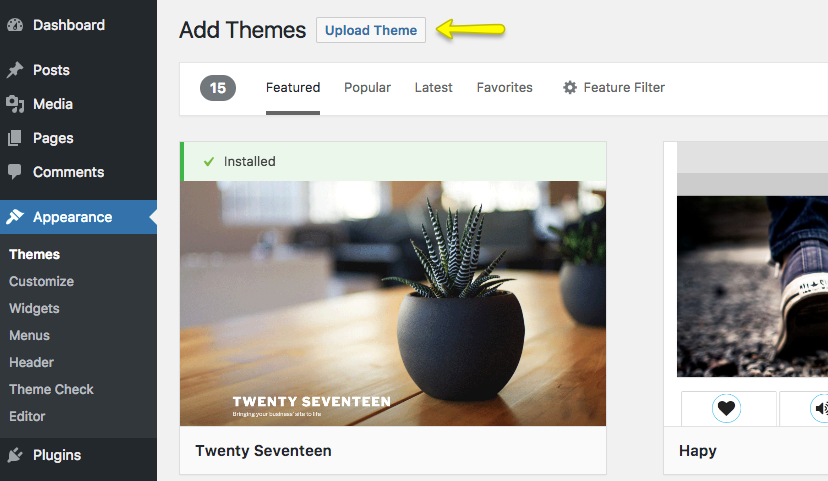
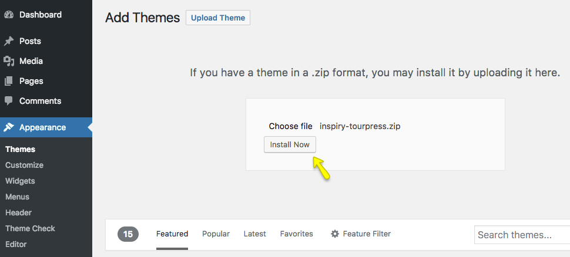
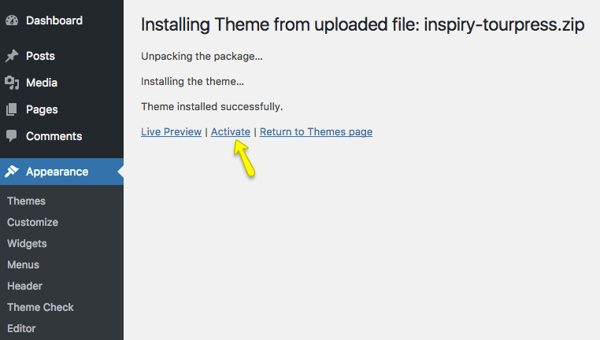
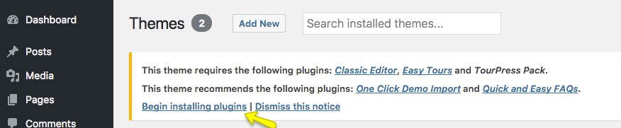
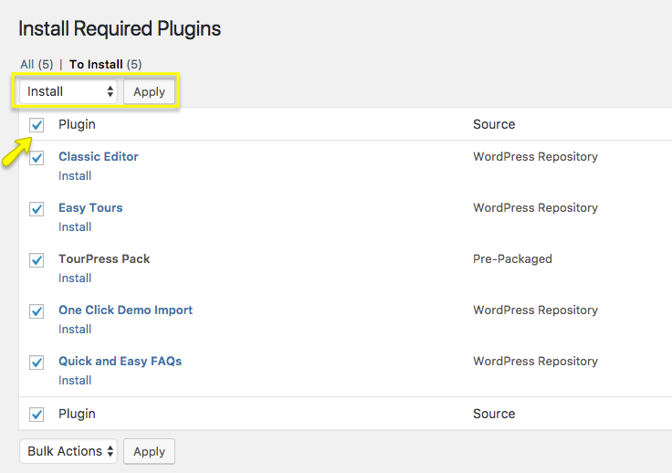
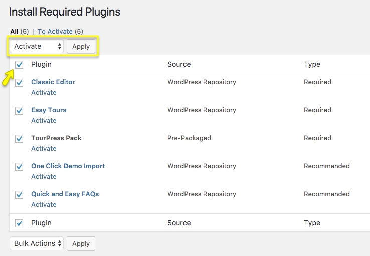
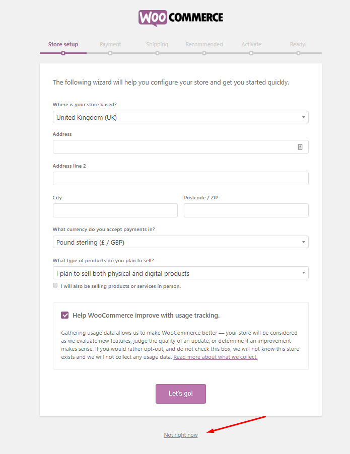

## 🧭 Getting Started: Installing the TourPress Theme

Before installing the TourPress theme, make sure you have a working installation of WordPress.

Most modern hosting providers offer one-click WordPress installations. If you're unsure, refer to your hosting provider’s support documentation. Alternatively, for manual installation, see the official WordPress guide:  🔗 [Installing WordPress – WordPress.org](https://codex.wordpress.org/Installing_WordPress)

Once WordPress is set up, head to your [ThemeForest Downloads](https://themeforest.net/downloads) page and download the “All Files & Documentation” package.

📦 After extraction, you’ll find the installable theme file: **inspiry-tourpress.zip**

---

## 📥 Installing the Theme via WordPress Dashboard (Recommended)

1. Navigate to `Dashboard → Appearance → Themes`
2. Click the **Add New** button  
   

3. Click **Upload Theme**  
   

4. Choose the file **inspiry-tourpress.zip**, then click **Install Now**  
   

5. Once installed, click **Activate**  
   

6. After activation, proceed to install required plugins.

!!! info ""
    If you encounter an error during upload, you can install the theme via FTP as described below.

---

## 🗂️ Installing the Theme via FTP (Alternative Method)

1. Connect to your web server using an FTP client like [FileZilla](https://filezilla-project.org/)
2. Navigate to your WordPress directory: `wp-content/themes/`
3. Extract the `inspiry-tourpress.zip` on your computer
4. Upload the extracted folder `inspiry-tourpress/` into the `themes/` directory
5. From your WordPress Dashboard, go to `Appearance → Themes`, and click **Activate** on TourPress

---

## 🧒 Installing the Child Theme (Recommended)

To safely customize your theme’s code without losing changes during updates, it’s strongly recommended to use the child theme.

📁 Included in the full package, you’ll find:  
**inspiry-tourpress-child.zip**

To install:

1. Go to `Dashboard → Appearance → Themes → Add New → Upload Theme`
2. Upload **inspiry-tourpress-child.zip** just like the parent theme
3. Click **Activate** once uploaded

🔒 Using a child theme allows you to:
- Add custom CSS or PHP changes safely
- Preserve changes during parent theme updates

📖 Learn more about child themes:  
[https://codex.wordpress.org/Child_Themes](https://codex.wordpress.org/Child_Themes)

---

## 🔌 Installing Required & Recommended Plugins

After activating the theme, WordPress will show a notification bar for installing necessary plugins.

1. Click **Begin Installing Plugins**  
   

2. Select all required and recommended plugins and click **Install**  
   

3. Once installed, click **Return to Required Plugins Installer**
4. Select all plugins again, then click **Activate**  
   

!!! warning ""
    When prompted by the WooCommerce setup wizard, it is important to **skip the wizard** to ensure smooth One Click Demo Import functionality.

   
