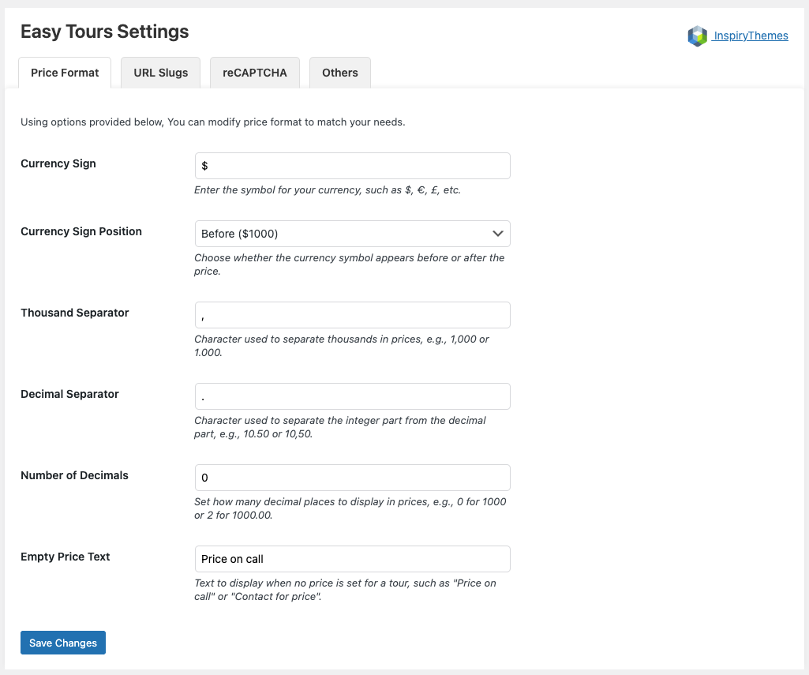

# Price Format Settings

Customize how prices are displayed across your tour listings.

🔹 Go to **Dashboard → Easy Tours → Settings → Price Format**

Available options:

- **Currency Sign**  
  Enter your preferred currency symbol (e.g., $, €, ₤, etc.)

- **Currency Sign Position**  
  Choose whether the symbol appears before or after the price (e.g., $1000 or 1000$)

- **Thousand Separator**  
  Symbol used to separate thousands (e.g., 1,000 or 1.000)

- **Decimal Separator**  
  Symbol used to separate integer and decimal parts (e.g., 10.50 or 10,50)

- **Number of Decimals**  
  Define how many decimal places to show

- **Empty Price Text**  
  Fallback text when no price is defined (e.g., “Price on Call”)

