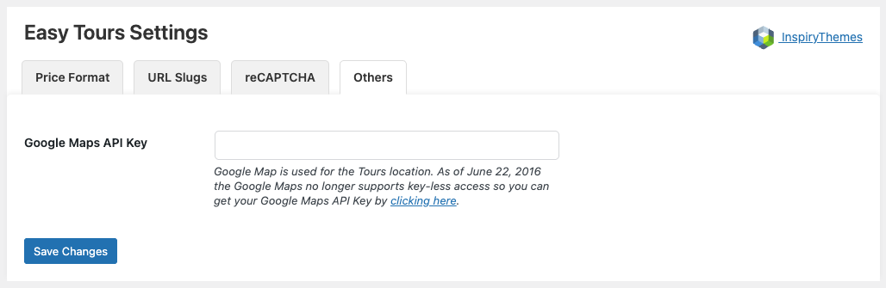

## 🌍 Google Maps API Settings

Enable Google Maps for tour locations using your API key.

🔹 Go to **Dashboard → Easy Tours → Settings → Others**

- **Google Maps API Key**  
  Enter your API key from Google here. Required for displaying maps on tour pages.

ℹ️ As of June 22, 2016, Google Maps requires an API key for all usage.  
You can learn how to generate a key here:  
[https://developers.google.com/maps/documentation/javascript/get-api-key](https://developers.google.com/maps/documentation/javascript/get-api-key)

