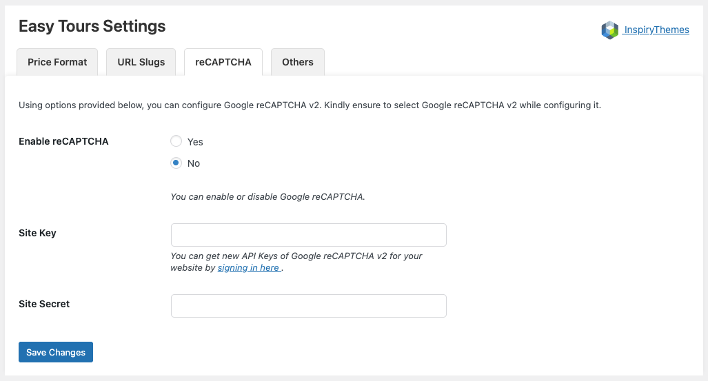

Protect your tour booking forms from spam by enabling Google reCAPTCHA v2.

🔹 Go to **Dashboard → Easy Tours → Settings → reCAPTCHA**

Available fields:

- **Enable reCAPTCHA**  
  Toggle ON/OFF (v2 only)

- **Site Key** & **Site Secret**  
  Generate your keys from the official Google reCAPTCHA admin panel:  
  [https://www.google.com/recaptcha/admin/create](https://www.google.com/recaptcha/admin/create)

ℹ️ Please ensure you select reCAPTCHA v2 when generating your keys.

