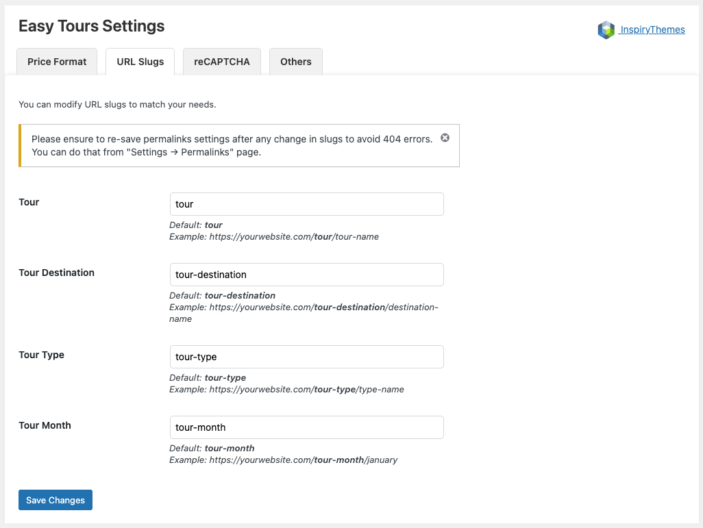

Customize the URL structure of tours and related taxonomies for improved SEO and clean permalinks.

🔹 Go to **Dashboard → Easy Tours → Settings → URL Slugs**

You can define custom slugs for:

- **Tour**  
  Default: `tour`  
  Example: `https://yourwebsite.com/tour/tour-name`

- **Tour Destination**  
  Default: `tour-destination`  
  Example: `https://yourwebsite.com/tour-destination/destination-name`

- **Tour Type**  
  Default: `tour-type`  
  Example: `https://yourwebsite.com/tour-type/type-name`

- **Tour Month**  
  Default: `tour-month`  
  Example: `https://yourwebsite.com/tour-month/january`

⚠️ After updating slugs, always re-save permalinks via:  
`Dashboard → Settings → Permalinks`

